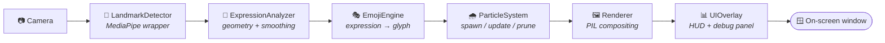

<div align="center">

# 😊 Emoji Rain AI

### Your face is the controller. Your webcam is the stage. Your expressions summon the weather.

**No black-box emotion model. No cloud API. No "AI vibes."**
Just real facial geometry — eye aspect ratio, mouth curvature, eyebrow height — computed 30+ times a second and turned into a living particle storm of emoji that matches exactly what your face is doing, right now.

```
python app.py
```

*...and the rain begins.*

[](.github/workflows/ci.yml)
[](LICENSE)
[](pyproject.toml)
[](https://github.com/psf/black)
[](tests/)

</div>

---

## 🪞 What am I looking at?

Point your webcam at your face. **Emoji Rain AI** tracks **468 individual facial landmarks** in real time using Google's MediaPipe Face Mesh, runs the geometry through an explicit, fully-transparent rule engine, and continuously spawns a physically-simulated rain of the matching emoji — floating, rotating, drifting, and fading upward like confetti that actually understands your mood.

Smile, and 😊 rains. Grin with teeth, and 😁 takes over. Wink, and 😉 replaces it mid-air. Change your face, change the weather — instantly, smoothly, and with zero training data.

<div align="center">

| Your face does this... | ...and this rains |
|:---:|:---:|
| 🙂 Smile | 😊 |
| 😁 Grin with teeth | 😁 |
| 😆 Laugh | 😂 |
| 😉 Wink one eye | 😉 |
| 😜 Wink + tongue out | 😜 |
| 😛 Tongue out | 😛 |
| 😲 Jaw drop + raised brows | 😲 |
| ☹️ Corners droop | 😢 |
| 😠 Brows furrow | 😠 |
| 😐 Anything else | 😐 |

</div>

---

## 📚 Table of Contents

- [Why This Exists](#-why-this-exists)
- [Features](#-features)
- [Architecture](#-architecture)
- [Installation](#-installation)
- [Requirements](#-requirements)
- [Usage](#-usage)
- [Supported Expressions](#-supported-expressions)
- [Configuration](#-configuration)
- [Calibration Guide](#-calibration-guide)
- [Folder Structure](#-folder-structure)
- [Emoji Font Setup](#-emoji-font-setup)
- [Troubleshooting](#-troubleshooting)
- [Testing](#-testing)
- [Screenshots](#-screenshots)
- [Roadmap](#-roadmap)
- [Contributing](#-contributing)
- [License](#-license)
- [Acknowledgements](#-acknowledgements)

---

## 🤔 Why This Exists

Most "emotion detection" demos wrap a pretrained black-box classifier around your webcam and call it a day. You get a label. You don't get to know *why*. You can't tune it. You can't trust it.

**Emoji Rain AI takes the opposite bet.** Every single decision is derived from measurable facial geometry:

```
mouth corners raised + face-height-normalized     →  smile_intensity  = +0.16
one eyelid closed, the other open                 →  wink detected
mouth open + eyebrows raised + eyes wide           →  shocked detected
```

No hidden layers. No "trust me." Every threshold lives in one file (`src/config.py`), every rule is a readable `if` statement (`src/expression_analyzer.py`), and a **live debug overlay** shows you the exact numbers driving each decision, frame by frame, so you can watch the classifier think and retune it for your own face in minutes.

---

## ✨ Features

- 🎯 **468-point facial landmark tracking** via MediaPipe Face Mesh, with iris refinement enabled
- 🧠 **Geometry-driven expression engine** — Eye Aspect Ratio, Mouth Aspect Ratio, smile intensity, eyebrow height, jaw opening, best-effort teeth/tongue color-based visibility, and full head-pose (yaw/pitch/roll) via `solvePnP`
- 🌊 **Temporal smoothing** with a rolling confidence-vote history, so expressions transition smoothly instead of flickering frame-to-frame
- ✨ **Custom particle engine, built from scratch** — every emoji is an independent particle with position, velocity, rotation, scale, opacity, horizontal drift, and lifetime, updated and faded every single frame
- 🎨 **Glassmorphism dark-theme HUD** — FPS, current expression, confidence, particle count, landmark count, detection status, camera status, all in a frosted-glass panel
- 🔬 **Live calibration/debug overlay** — see the exact raw numbers (`EAR`, `MAR`, `SMILE`, `EYEBROW`, `TEETH`, `TONGUE`, and the pre-smoothing raw candidate) driving every decision, in real time
- ⚙️ **Every constant is configurable** — thresholds, colors, spawn rates, particle physics, all in one typed config module, zero magic numbers anywhere else
- 🪵 **Structured, colorized logging** to console and rotating log files
- ✅ **45 passing unit tests** covering camera lifecycle, geometry math, the full classification decision tree, temporal smoothing, and particle simulation
- 🛠️ **CI-ready out of the box** — GitHub Actions runs linting, formatting checks, type-checking, and the full test suite on every push

---

## 🏗️ Architecture

Clean architecture, single-responsibility modules, dependencies flowing in one direction: raw I/O → analysis → presentation.



`app.py` (`EmojiRainApp`) is a thin orchestrator — it owns the OpenCV window and the main loop, and calls each module in the right order every frame. **All real logic lives in `src/`**, and every file does exactly one job:

| Module | Responsibility |
|---|---|
| `camera.py` | Webcam capture, reconnect logic, mirror mode |
| `landmark_detector.py` | MediaPipe Face Mesh wrapper — the *only* file that imports `mediapipe` |
| `geometry.py` | Pure, stateless math: EAR, MAR, smile intensity, eyebrow height, head pose |
| `expression_analyzer.py` | The decision tree + temporal smoothing/voting history |
| `emoji_engine.py` | Maps the current expression to a glyph + accent color |
| `particle.py` / `particle_system.py` | The physics: spawn, update, fade, prune, population cap |
| `renderer.py` | PIL-based compositing — color emoji glyphs + glassmorphism panels |
| `ui.py` | The HUD and the live debug/calibration panel |
| `app_state.py` | Plain-data snapshot of everything the UI needs, per frame |
| `config.py` | Every single tunable constant, in one place |

---

## 🚀 Installation

```bash
# 1. Clone the repository
git clone https://github.com/your-org/Emoji-Rain-AI.git
cd Emoji-Rain-AI

# 2. Create and activate a virtual environment (recommended)
python -m venv .venv
source .venv/bin/activate        # Windows: .venv\Scripts\Activate.ps1

# 3. Install dependencies
pip install -r requirements.txt
```

> **Windows + mediapipe note:** MediaPipe's Windows wheels currently support **Python 3.9–3.11**. If `pip install` fails on `mediapipe`, check `python --version` — if you're on 3.12+, create the venv with an older interpreter instead: `py -3.11 -m venv .venv`.

---

## 📋 Requirements

- Python **3.9 – 3.11**
- A webcam
- OS packages for OpenCV's GUI backend on Linux: `libgl1`, `libglib2.0-0`
- See [`requirements.txt`](requirements.txt) for pinned versions: `opencv-python`, `mediapipe`, `numpy`, `Pillow`

---

## 🎮 Usage

```bash
python app.py
```

| Key | Action |
|:---:|---|
| `q` / `Esc` | Quit the application |
| `h` | Toggle the main HUD stats panel |
| `d` | Toggle the live debug/calibration panel (**on by default**) |
| `l` | Toggle raw landmark dot overlay |

Make a face. Hold it for a moment. Watch the rain change.

---

## 🎭 Supported Expressions

<div align="center">

| Expression | Emoji | Geometric trigger |
|:---:|:---:|---|
| Neutral | 😐 | Default — nothing else matched |
| Smile | 😊 | Mouth corners raised above baseline |
| Big Smile | 😁 | Strong upward curvature **and** teeth visible |
| Laugh | 😂 | Mouth wide open **and** eyes narrowed/squinted |
| Wink | 😉 | One eye closed, the other clearly open |
| Tongue Wink | 😜 | Wink **and** tongue visible |
| Tongue Out | 😛 | Mouth open **and** tongue visible, both eyes open |
| Shocked | 😲 | Mouth open **and** eyebrows raised **and** eyes wide |
| Sad | 😢 | Mouth corners clearly drooping below baseline |
| Angry | 😠 | Eyebrows lowered/furrowed **and** mouth flat |

</div>

Every expression is temporally smoothed — the display only switches once a rolling vote of recent frames agrees, so momentary noise (a stray blink, a flicker of landmark jitter) doesn't cause the rain to stutter between glyphs.

---

## ⚙️ Configuration

Every tunable value in the entire application lives in [`src/config.py`](src/config.py), grouped into typed, documented dataclasses:

| Config class | Controls |
|---|---|
| `CameraConfig` | Resolution, FPS, device index, mirror mode, reconnect behavior |
| `LandmarkConfig` | MediaPipe detection/tracking confidence, iris refinement |
| `ExpressionThresholds` | Every geometric threshold (EAR, MAR, smile, eyebrows, teeth/tongue) and smoothing parameters |
| `EmojiMappingConfig` | Expression → emoji glyph and accent color |
| `ParticleConfig` | Max particles, spawn rate, speed, scale, drift, lifetime, fade behavior |
| `UIConfig` | HUD colors, fonts, panel size, corner radius, debug panel toggle |
| `LoggingConfig` | Console/file log levels, log rotation |

Change a value, save, re-run. No other code changes needed, anywhere.

---

## 🔬 Calibration Guide

Facial geometry varies by face shape, camera angle, and lighting — the shipped thresholds are a reasonable starting point, **not a universal fit**. If an expression isn't triggering reliably for you, don't guess — *look*:

1. Run `python app.py`. The debug panel is **on by default**, right next to the main HUD (`d` toggles it).
2. It streams the live, raw numbers behind every decision: `EAR L/R`, `EAR AVG`, `MAR`, `MOUTH OPEN`, `SMILE`, `EYEBROW`, `TEETH VISIBLE`, `TONGUE VISIBLE`, and `RAW CANDIDATE` (the pre-smoothing per-frame guess).
3. Hold each expression and watch which number actually moves:
   - **Wink** → watch `EAR L / R`; one side should drop well below the other.
   - **Big smile with teeth** → watch `SMILE` rise and `TEETH VISIBLE` flip to `YES` once teeth actually show (a closed-mouth smile will never show teeth — that's correct, not a bug).
   - **Sad** → watch `SMILE` go *negative*.
   - **Angry** → watch `EYEBROW` go negative as your brows lower.
   - **Shocked** → watch `MOUTH OPEN` and `EYEBROW` rise together.
4. Open `src/config.py` → `ExpressionThresholds`, and nudge the relevant threshold just past what you observed.
5. Save, re-run. That's it.

This is by far the fastest way to make the classifier feel right for *your* face, since the shipped defaults were tuned analytically, not against real camera data.

---

## 📁 Folder Structure

```
Emoji-Rain-AI/
├── .github/workflows/ci.yml     # Lint, format, type-check, test on every push
├── assets/                      # Fonts, emoji assets, sounds, icons
├── docs/screenshots/            # README screenshots / demo media
├── models/                      # Optional local model cache
├── src/
│   ├── app_state.py             # Shared mutable per-frame state
│   ├── camera.py                # Webcam capture wrapper
│   ├── config.py                # Every tunable setting, one place
│   ├── emoji_engine.py          # Expression → emoji glyph/color
│   ├── expression_analyzer.py   # The decision tree + smoothing
│   ├── geometry.py              # Pure landmark math
│   ├── landmark_detector.py     # MediaPipe Face Mesh wrapper
│   ├── logger.py                # App-wide logging setup
│   ├── particle.py              # A single animated particle
│   ├── particle_system.py       # Spawns/updates/prunes particles
│   ├── renderer.py              # PIL compositing: particles + panels
│   ├── ui.py                    # HUD + debug/calibration overlay
│   └── utils.py                 # FPS counter, delta timer, math helpers
├── tests/                       # 45 passing tests
├── app.py                       # Entry point — python app.py
├── requirements.txt
├── pyproject.toml
├── LICENSE
└── README.md
```

---

## 🔤 Emoji Font Setup

OpenCV can't render color emoji glyphs natively, so the renderer uses **Pillow** with a system or bundled emoji font, searched in this order:

1. `assets/fonts/NotoColorEmoji.ttf` or `assets/fonts/Seguiemj.ttf` (drop one here yourself)
2. Common OS paths (Noto Color Emoji on Linux, Segoe UI Emoji on Windows, Apple Color Emoji on macOS)
3. A plain fallback font (emoji render as empty boxes if nothing above is found)

**Best experience:**

| Platform | Action |
|---|---|
| Windows / macOS | Nothing — Segoe UI Emoji / Apple Color Emoji are pre-installed |
| Linux (Debian/Ubuntu) | `sudo apt-get install fonts-noto-color-emoji` |
| Manual | Download `NotoColorEmoji.ttf` from [Noto Emoji](https://github.com/googlefonts/noto-emoji) → `assets/fonts/` |

---

## 🩹 Troubleshooting

<details>
<summary><b>ModuleNotFoundError: No module named 'cv2'</b></summary>

Your virtual environment is empty. Run `pip install -r requirements.txt` inside the activated venv before running `app.py`.
</details>

<details>
<summary><b>mediapipe fails to install</b></summary>

Almost always a Python version mismatch — MediaPipe's Windows wheels currently support Python 3.9–3.11. Check `python --version`; if 3.12+, recreate the venv with `py -3.11 -m venv .venv`.
</details>

<details>
<summary><b>Emoji render as empty boxes / tofu squares</b></summary>

No color-emoji-capable font was found on your system. See <a href="#-emoji-font-setup">Emoji Font Setup</a> above.
</details>

<details>
<summary><b>An expression won't trigger no matter what I do</b></summary>

Don't guess — open the debug panel (`d`) and watch the actual numbers while you make the face. See <a href="#-calibration-guide">Calibration Guide</a>.
</details>

<details>
<summary><b>Low FPS / choppy particle motion</b></summary>

Lower `camera.frame_width` / `frame_height` in <code>src/config.py</code>, or reduce <code>particles.max_particles</code> and <code>particles.spawn_rate_per_second</code>.
</details>

---

## 🧪 Testing

```bash
pytest --cov=src --cov-report=term-missing
```

**45 tests**, covering:

- `tests/test_camera.py` — open/read/release lifecycle and reconnect logic, against a fake `VideoCapture` (no real hardware needed)
- `tests/test_expression.py` / `tests/test_expression_analyzer.py` — geometry primitives and the full classification decision tree, plus temporal-smoothing stability and the switch-away-from-initial-state regression guard
- `tests/test_particle.py` — particle motion, rotation, fade in/out, lifetime/expiry, and particle-system spawn/cap/prune behavior

---

## 📸 Screenshots

> Drop your own captures into `docs/screenshots/` and reference them here:
>
> 
>
> A `docs/demo.gif` at the top of this README is the natural next step once you have one recorded.

---

## 🗺️ Roadmap

- [ ] Multi-face support (currently tracks the primary detected face)
- [ ] Custom emoji packs / full theming via config
- [ ] Sound effects tied to expression changes (`assets/sounds/` is scaffolded and ready)
- [ ] On-screen calibration wizard to auto-personalize thresholds to your neutral baseline
- [ ] Standalone packaged executable (PyInstaller)
- [ ] GPU-accelerated rendering path for very high particle counts

---

## 🤝 Contributing

1. Fork the repo, create a feature branch.
2. `pip install -r requirements.txt`
3. Match the existing style — `black` formatting, `ruff` linting, type hints + docstrings on every public function/class.
4. Add or update tests for any behavior change.
5. Run `black`, `ruff check`, `mypy`, and `pytest` locally — CI runs the same checks.
6. Open a PR describing the change and why it's needed.

Keep modules single-responsibility. New thresholds go in `src/config.py`, never as inline magic numbers.

---

## 📄 License

Distributed under the [MIT License](LICENSE).

---

## 🙏 Acknowledgements

- [MediaPipe](https://github.com/google/mediapipe) by Google — the Face Mesh solution powering every landmark
- [OpenCV](https://opencv.org/) — camera capture and core image operations
- [Pillow](https://python-pillow.org/) — color emoji rendering and glassmorphism compositing
- Eye Aspect Ratio technique based on Soukupová & Čech, *"Real-Time Eye Blink Detection using Facial Landmarks"* (2016)

<div align="center">

**Made with 🧠 geometry, not 🪄 magic.**

</div>
